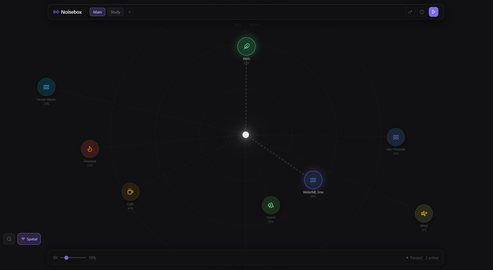
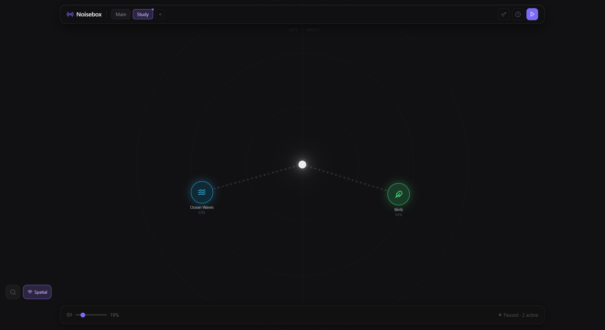

<div align="center">
  

  # Noisebox

  An ambient sound mixer desktop app. Layer rain, fire, ocean waves, café chatter and more on a free-form canvas, save the mix as a preset, and let it run while you focus, relax, or sleep.
</div>

---

<p align="center">
  
  
</p>

---

## Features

- **Two playground modes** — a classic drag-and-drop canvas, or an "orbit" canvas where a sound's distance from the center controls its volume and its horizontal position controls stereo pan (spatial audio)
- **Layered mixing** — add as many sounds as you like, each with independent volume
- **Presets** — save, load, and manage named mixes, persisted locally
- **Sleep / Pomodoro timer** — stop playback automatically or cycle focus/break sessions
- **Bring your own sounds** — search and add sounds on demand; a handful ship bundled, the rest are fetched on first use (see below) and cached forever afterward
- **System tray** — minimizes to tray instead of quitting; toggle the window from the tray icon

## How sound works

Noisebox doesn't bundle a large sound library — that would bloat the installer. Instead, when you add a sound it's resolved in this order:

1. **Bundled** — a small set of sounds ship with the app in `public/sounds/`
2. **Cached** — anything you've used before, stored in your OS app-data directory
3. **Downloaded on demand** — fetched from [Freesound](https://freesound.org/) (primary) or [Pixabay](https://pixabay.com/) (fallback) using your own free API key, then cached for offline use

To enable on-demand downloading, open the app's API key settings and paste in a Freesound and/or Pixabay API key (both are free to obtain from their respective developer portals).

## Development

**Prerequisites:** [Node.js](https://nodejs.org/) 18+, [Rust](https://www.rust-lang.org/tools/install), and [pnpm](https://pnpm.io/).

```bash
pnpm install        # install dependencies
pnpm tauri dev      # run the app (Rust backend + React frontend, hot-reloading)
```

> Use `pnpm tauri dev` rather than `pnpm dev` — most of the app's functionality (sound downloading/caching, presets, settings, system tray) depends on the Tauri runtime and won't work in a plain browser tab.

To populate the bundled sounds in `public/sounds/` (gitignored, fetched from Freesound/Pixabay):

```bash
FREESOUND_API_KEY=xxx pnpm download-sounds
```

### Building

```bash
pnpm tauri build
```

Produces platform installers in `src-tauri/target/release/bundle/` (`.msi`/`.exe` on Windows, `.dmg` on macOS, `.AppImage`/`.deb` on Linux).

## Tech stack

Tauri 2 (Rust) · React 19 · Vite · TypeScript · Zustand · Tailwind CSS · Howler.js · dnd-kit · Framer Motion

## License

[MIT](LICENSE)
